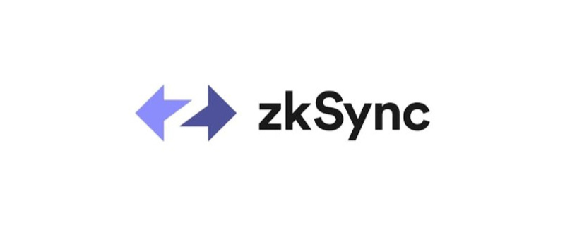

# awesome-zksync

↔️ A curated list of awesome zkSync resources

## zkSync Era

zkSync Era is a ZK rollup that supports generalized EVM compatibility for the Ethereum blockchain. The primary benefit of zkSync Era is that developers who have created EVM dApps can port to zkSync Era effortlessly and realize significantly lower gas fees and more transactions per second.

### Resources

- [Docs](https://v2-docs.zksync.io/dev/) - Official Docs
- [Tutorials](https://v2-docs.zksync.io/dev/tutorials/) - Official Tutorials
- [zkSync ELI5 (Explain Like I'm 5)](https://twitter.com/0xangelfish/status/1460303951627128832) - Twitter thread
- [zkPorter ELI5](https://twitter.com/0xangelfish/status/1460741464757919744) - Twitter thread
- [Visual guide to Layer 2s](https://mirror.xyz/cliffton.eth/mCO-oaRIOyvEpIZ5hJrmU-cNDZ3Z9Es7mXOPH_I9uoM)
- [zkEVM FAQ](https://zksync.io/zkevm/) - Official zkEVM FAQ

### Tools

- [Wallet](https://portal.zksync.io/)
- [Bridge](https://portal.zksync.io/bridge)
- [Block explorer](https://zksync2-mainnet.zkscan.io/)
- [Smart contract verification](https://scan-v2.zksync.dev/contracts/verify)
- [zkEVM debugger](https://scan-v2.zksync.dev/tools/debugger)

### Articles

- [Different types of zkEVMs](https://vitalik.ca/general/2022/08/04/zkevm.html) - Vitalik
- [Baby Alpha has arrived](https://blog.matter-labs.io/baby-alpha-has-arrived-5b10798bc623) - Mainnet launch
- [End-to-end prover live on testnet](https://blog.matter-labs.io/milestone-3-zksync-end-to-end-prover-is-now-live-on-testnet-9ee4fdc1874f) - Announcement of milestone 3 completed
- [100 days to Mainnet](https://blog.matter-labs.io/100-days-to-mainnet-6f230893bd73) - zkSync v2 roadmap
- [zkPorter: a breakthrough in L2 scaling](https://medium.com/matter-labs/zkporter-a-breakthrough-in-l2-scaling-ed5e48842fbf) - Ending the debate between ZK and optimistic rollups
- [zkEVM Reddit AMA](https://www.reddit.com/r/ethereum/comments/q8q822/ama_were_matter_labs_the_team_behind_zksync_the/) - We’re Matter Labs, the team behind zkSync, the first EVM-Compatible ZK Rollup, powered by our zkEVM
- [UniSync Demo](https://medium.com/matter-labs/unisync-a-port-of-uniswap-v2-on-the-zkevm-b12954748504) - A port of Uniswap V2 on the zkEVM

### Videos

- [zkEVM](https://youtu.be/6wLSkpIHXM8) - by Alex Gluchowski @ ETHGlobal
- [zkSync 2 (overview)](https://www.youtube.com/watch?v=7jPusi4BJWc) - by Alex Gluchowski @ Epicenter
- [zkSync 2 - first EVM-compatible zkRollup](https://www.youtube.com/watch?v=zknVgruhjnU) - by Alex Gluchowski @ EthCC[4]
- [The zkEVM is Here](https://www.youtube.com/watch?v=QkZUlqetTRA) - Steve Newcomb @ Bankless
- [zkEVM: Compatibility vs Equivalence](https://www.youtube.com/watch?v=-Kglh-5Na-k&t=2265s) - Alex Gluchowski @ 8th Global Blockchain Summit
- [EIP4844 panel](https://www.youtube.com/watch?v=idBYmaok520&t=13461s) - DevCon Bogotá workshop

### Projects

- [Uniswap](https://app.uniswap.org/#/vote/2/25) - Approved proposal to deploy Uniswap v3 to zkSync v2
- [The Graph](https://blog.matter-labs.io/thegraph-51c45d351029) - zkSync will be the first ZK-Protocol indexed by The Graph
- [Aave](https://snapshot.org/#/aave.eth/proposal/0x8257d8c7681a3587a61f0d97997045c4d35815031d56386c854afa66f0d04351) - Approved proposal to deploy Aave to zkSync
- [Crypto.com](https://blog.matter-labs.io/cryptocom-cb911e7ba58c) - Crypto.com Is Scaling Ethereum with zkSync, the First EVM-Compatible ZK Rollup
- [Curve](https://gov.curve.fi/t/proposal-to-launch-curve-on-zksync/4367) - Proposal to deploy Curve on zkSync
- [Ecosystem overview](https://ecosystem.zksync.io/) - List with more than 150 projects
- [zksync-starter](https://github.com/ewerx/zksync-starter) - zkSync + Next.js Turborepo starter kit / template project

> **IMPORTANT** If you want to deploy your project to zkSync v2, make sure to submit your project in the [ecosystem page](https://ecosystem.zksync.io/)

## zkSync 1.0

zkSync v1 is a trustless protocol for scalable low-cost payments on Ethereum, powered by zkRollup technology. It uses zero-knowledge proofs and on-chain data availability to keep users' funds as safe as though they never left the mainnet.

### Resources

- [What is a zkRollup?](https://ethereum.org/en/developers/docs/scaling/layer-2-rollups/#zk-rollups) - Official Ethereum Documentation
- [Tutorials](https://zksync.io/userdocs/tutorials.html) - Official Tutorials
- [Docs](https://zksync.io/dev/) - Official Docs
- [Data](https://dune.xyz/Marcov/zkSync) - zkSync Analytics on Dune

### FAQ

- [zkSync FAQ](https://zksync.io/userdocs/faq.html) - Official zkSync FAQ

### Articles

- [How Ethereum merge affects zkSync](https://blog.matter-labs.io/the-ethereum-merge-how-it-affects-zksync-ba3f00b8542b) - As the most Ethereum-aligned L2, zkSync will evolve with the Ethereum ecosystem
- [DeFi](https://blog.matter-labs.io/leading-defi-projects-and-exchanges-invest-to-bring-solidity-to-zksync-9a3df978f824) - Leading Defi projects, wallets and exchanges invest to bring Solidity to zkSync

### Videos

- [zkSync Learn by Watching](https://zksync.io/faq/learnbywatching.html) - Official site suggestions
- [Proof of Decentralization](https://www.crowdcast.io/e/pod-zksync) - by Chris Blec

### Projects Support

- [Aave](https://www.argent.xyz/blog/how-to-earn-interest-with-aave-on-layer-2/) - How to earn interest with Aave on Layer 2
- [ParaSwap](https://twitter.com/paraswap/status/1469429505060126728) - This is the very first ZkSync / ParaSwap transaction
- [Argent](https://support.argent.xyz/hc/en-us/articles/4406742741649-How-to-fund-your-zkSync-account-from-another-wallet-or-exchange) - How to fund your zkSync account from another wallet or exchange

### Jobs

- [Open Positions at MatterLabs](https://jobs.eu.lever.co/matterlabs)

### Tools

- [Block Explorer](https://zkscan.io/) - zkScan: Mainnet | Explore L2 Rollup Blockchain
- [L2 fees](https://l2fees.info/) - Fee to transfer and swap tokens
- [Wallet](https://wallet.zksync.io/) - A crypto wallet & gateway to layer-2 zkSync Rollup
- [Payment Link Creator](https://link.zksync.io/) - Create zkSync payment links, get paid in tokens
- [Alternate Withdrawal Tool](https://withdraw.zksync.io/) - Easily move your funds to L1 without interaction with L2
- [Testnet status page](https://uptime.com/statuspage/zkSync-testnet) - Check current status and incident history of zkSync testnet
- [Mainnet status page](https://uptime.com/statuspage/zkSync) - Check current status and incident history of zkSync mainnet

## Official Links

The following are official links

- [Website](https://zksync.io/)
- [GitHub](https://github.com/matter-labs)
- [Twitter](https://twitter.com/zksync)
- [Discord](https://join.zksync.dev/)
- [YouTube](https://www.youtube.com/c/MatterLabs)
- [Reddit](https://www.reddit.com/r/zkSync/)
- [Medium](https://blog.matter-labs.io/)

---

➕ Always verify the authenticity of the links
